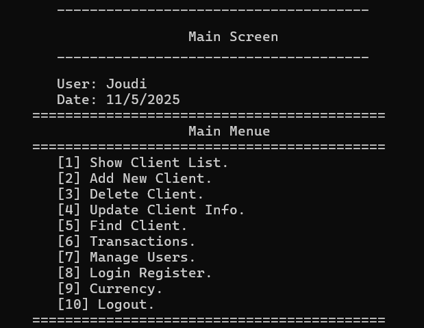
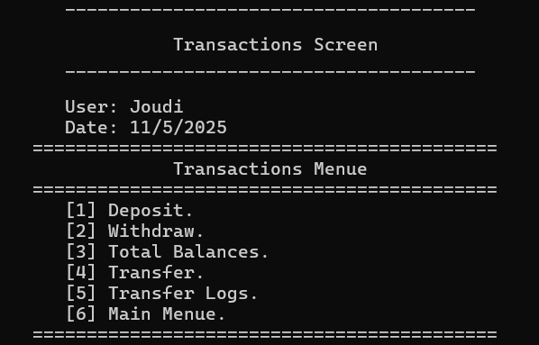
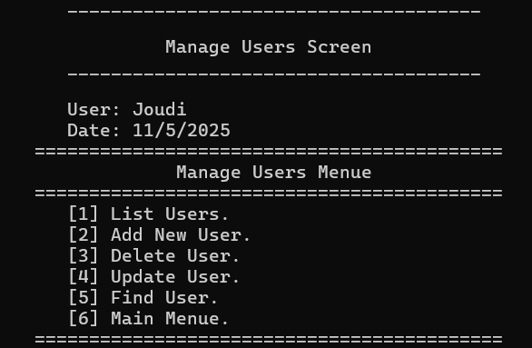
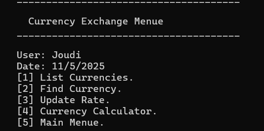
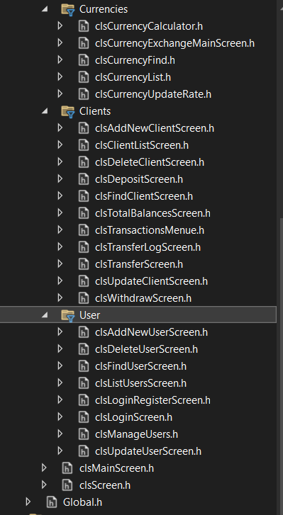
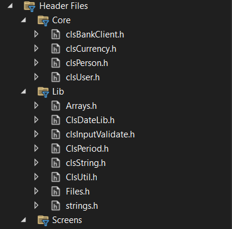

🏦 Bank Management System (C++ OOP Project)
📌 Overview

This project is a Bank Management System built in C++ using the principles of Object-Oriented Programming (OOP).
It simulates a real banking system with multiple modules such as user management, client management, transactions, and currency exchange.

The project is designed with clean modular architecture, separating Core logic, Libraries, and Screens for better scalability and maintainability.

🚀 Features
🔑 User Management

Add, update, delete, and search for users.

Login & Register system with role-based access.

Manage all users in the system.

👥 Client Management

Add, update, delete, and search for clients.

View all clients.

Manage deposits, withdrawals, transfers, and balances.

Transaction logs with date & user tracking.

💸 Transactions

Deposit & Withdraw money.

Transfer between clients.

View total balances.

Transaction history (logs).

🌍 Currency Exchange

List available currencies.

Find and update currency exchange rates.

Currency calculator for conversions.

🛠️ Project Structure

├── Core
│   ├── clsBankClient.h
│   ├── clsCurrency.h
│   ├── clsPerson.h
│   └── clsUser.h
│
├── Lib
│   ├── Arrays.h
│   ├── ClsDateLib.h
│   ├── clsInputValidate.h
│   ├── ClsPeriod.h
│   ├── clsString.h
│   ├── ClsUtil.h
│   ├── Files.h
│   └── strings.h
│
├── Screens
│   ├── Clients
│   ├── Currencies
│   ├── User
│   ├── clsMainScreen.h
│   └── clsScreen.h
│
└── Global.h

📷 Screenshots

# Bank System Project

## Screenshots

### 1. Main Screen

### 2. Transactions Screen

### 3. Manage Users Screen

### 4. Currency Exchange Screen

### 5. Project Files And Folders (One)

### 6. Project Files And Folders (Two)

⚙️ Technologies

Language: C++

Paradigm: Object-Oriented Programming (OOP)

Architecture: Modular (Core / Lib / Screens)

Data Storage: Files

🎯 Future Improvements

Add Database integration (SQL / SQLite).

Implement Graphical User Interface (GUI).

Add Authentication with hashing.

Improve logging system with timestamps & error handling.

👤 Author

Joudi

Cybersecurity & Software Engineering Enthusiast
